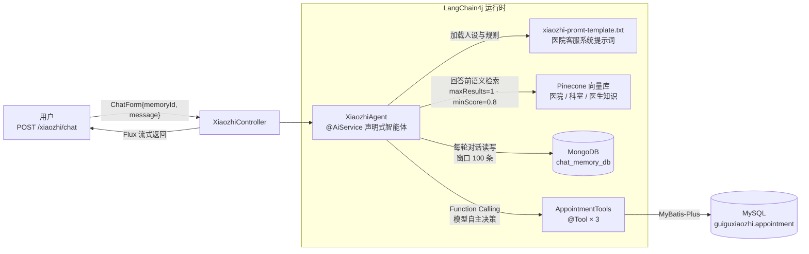

<div align="center">

# 🏥 硅谷小智 · 医院智能预约挂号助手

**LangChain4j 智能体 × Function Calling 工具调用 × RAG 向量检索 × MongoDB 会话记忆**

[](https://openjdk.java.net/)
[](https://spring.io/projects/spring-boot)
[](https://docs.langchain4j.dev/)
[](https://www.mysql.com/)
[](https://www.mongodb.com/)
[](https://www.pinecone.io/)

*A LangChain4j-powered hospital AI assistant — Function Calling + RAG + Persistent Chat Memory.*

</div>

---

基于 LangChain4j AiServices 的智能体应用：**硅谷小智**是一家医院的智能客服与医疗伴诊助手，具备 AI 分导诊、查询号源、预约挂号、取消挂号四大能力。大模型通过 **Function Calling 自主决策**调用挂号工具并落库 MySQL，回答前经 **RAG** 检索医院/科室/医生知识库，多轮对话记忆持久化到 MongoDB，接口全程流式输出。

> 项目为 LangChain4j 学习实战项目（硅谷小智课程实战），从单智能体出发，预留了 MCP、多智能体协同的演进路线（见文末 Roadmap）。

## ✨ 功能特性

- 🤖 **声明式智能体**：一个 `@AiService` 接口完成全部装配——流式模型、记忆、工具、RAG 检索器四件套注解即用
- 🛠️ **Function Calling**：模型自主决定何时"查号源 / 预约 / 取消预约"，工具执行结果再喂回模型生成自然语言答复，预约数据真实写入 MySQL
- 🔍 **RAG 知识库**：医院信息、科室信息、医生介绍向量化入 Pinecone，`minScore=0.8` 高置信检索注入上下文，"没指定医生时从知识库找一位医生"
- 💬 **持久化会话记忆**：`MessageWindowChatMemory`（窗口 100 条）+ MongoDB 存储，按 `memoryId` 隔离多会话，应用重启对话不丢
- 🌊 **流式输出**：`Flux<String>` 逐 token 响应，配合 `text/event-stream` 风格的 `text/stream` 接口
- 📋 **提示词工程**：医院客服人设 + 预约必填信息校验规则 + `{{current_date}}` 动态日期，系统提示词外置为资源文件可随时调整
- 📡 **接口文档**：集成 Knife4j，接口自动生成中文文档

## 🏗️ 架构



**工具调用闭环（这就是"智能体"的运行方式）**：

1. 用户消息进入 `XiaozhiAgent`，LangChain4j 把 3 个 `@Tool` 的方法签名与描述生成 JSON Schema，随请求一并发给大模型；
2. 模型结合系统提示词、RAG 检索结果与对话记忆推理，**自主决定**是否调用工具（返回 tool-call 而非普通文本）；
3. 框架在本地执行对应 Java 方法，预约记录写入 MySQL；
4. 执行结果作为"观察"回喂模型，模型据此生成最终自然语言回答流式输出。

> 一句话：业务代码里没有任何一行去调用 `bookAppointment()`——什么时候预约、怎么收集信息，全是模型自己决定的。把 `tools` 这行配置删掉，项目就退化成一个普通的"带知识库的聊天机器人"。

| 工具（`@Tool`） | 职责 | 落库 |
|---|---|---|
| `预约挂号 bookAppointment` | 查重 → 防幻觉清 id → 写入预约记录 | MySQL `appointment` |
| `取消预约挂号 cancelAppointment` | 存在校验 → 删除预约记录 | MySQL `appointment` |
| `查询是否有号源 queryDepartment` | 号源查询（**当前为占位实现，固定返回 true**，见 Roadmap） | — |

## 🚀 快速开始

### 环境要求

| 依赖 | 要求 |
|---|---|
| JDK | 17 |
| Maven | 3.6.3+（Spring Boot 3.5 的硬性要求） |
| MySQL | 8.x（库名 `guiguxiaozhi`） |
| MongoDB | 4.x+（默认 `localhost:27017`） |
| Pinecone | Serverless 账号（索引首次启动自动创建） |
| LLM | 任意 OpenAI 兼容端点（默认智谱 GLM） |

### 1. 初始化 MySQL

```sql
CREATE DATABASE guiguxiaozhi DEFAULT CHARACTER SET utf8mb4;
USE guiguxiaozhi;
CREATE TABLE appointment (
  id          BIGINT AUTO_INCREMENT PRIMARY KEY,
  username    VARCHAR(64)  COMMENT '用户姓名',
  id_card     VARCHAR(32)  COMMENT '身份证号',
  department  VARCHAR(64)  COMMENT '预约科室',
  date        VARCHAR(32)  COMMENT '预约日期',
  time        VARCHAR(16)  COMMENT '上午/下午',
  doctor_name VARCHAR(64)  COMMENT '医生名称'
);
```

### 2. 配置密钥

编辑 `src/main/resources/application.yml`（该文件含密钥，建议加入 `.gitignore`，勿提交）：

```yaml
langchain4j:
  open-ai:
    streaming-chat-model:
      base-url: https://open.bigmodel.cn/api/paas/v4   # 智谱 OpenAI 兼容端点
      api-key: <你的 LLM API Key>
      model-name: glm-4.5-air
    embedding-model:
      base-url: https://api.siliconflow.cn/v1          # 硅基流动
      api-key: <你的 Embedding API Key>
      model-name: BAAI/bge-m3

spring:
  data:
    mongodb:
      uri: mongodb://localhost:27017/chat_memory_db
  datasource:
    url: jdbc:mysql://localhost:3306/guiguxiaozhi?useUnicode=true&characterEncoding=UTF-8&serverTimezone=Asia/Shanghai&useSSL=false
    username: root
    password: <你的 MySQL 密码>

pinecone:
  api-key: <你的 Pinecone API Key>
```

常用 LLM 端点（OpenAI 兼容协议，替换 `base-url` + `model-name` 即可切换厂商）：

| 厂商 | base-url | 模型示例 |
|---|---|---|
| 智谱 AI | `https://open.bigmodel.cn/api/paas/v4` | `glm-4.5-air` |
| DeepSeek | `https://api.deepseek.com/v1` | `deepseek-chat` |
| OpenAI | `https://api.openai.com/v1` | `gpt-4o-mini` |

### 3. 启动

```bash
mvn spring-boot:run
```

| 入口 | 地址 |
|---|---|
| 对话接口 | `POST http://localhost:8080/xiaozhi/chat` |
| 接口文档 Knife4j | <http://localhost:8080/doc.html> |

### 4. 调用示例

```bash
curl -N -X POST http://localhost:8080/xiaozhi/chat \
  -H "Content-Type: application/json" \
  -d '{"memoryId": 1, "message": "我最近经常头晕，应该挂什么科？"}'
```

- `memoryId`：会话 ID，相同 `memoryId` 共享一份记忆（存 MongoDB）
- 响应为 `text/stream;charset=utf-8` 流式文本
- 换一句试试："帮我明天上午预约神经内科的号"——观察日志，能看到模型发起的 tool-call 与工具执行记录

## 🧠 记忆与 RAG

**会话记忆**：`MongoChatMemoryStore` 实现 LangChain4j 的 `ChatMemoryStore` SPI，消息列表经 `ChatMessageSerializer` 序列化为 JSON 存入 MongoDB（`upsert` 按 `memoryId` 更新），读取时反序列化还原，跨重启不丢。

**向量检索**：`EmbeddingStoreConfig` 使用 Pinecone Serverless（AWS `us-east-1`），索引 `xiaozhi-index`、命名空间 `xiaozhi-namespace` 不存在时自动创建，向量维度自动对齐 `bge-m3`（1024 维）。检索器每次回答最多取 1 条、最低得分 0.8，保证注入的是高置信知识。

## 📁 项目结构

```
src/main/java/com/tinglan
├── assistant/    # XiaozhiAgent：@AiService 声明式智能体入口（模型/记忆/工具/RAG 装配点）
├── bean/         # ChatForm 请求体、XiaozhiChatMessages Mongo 文档
├── config/       # XiaozhiAgentConfig（记忆提供者+检索器）、EmbeddingStoreConfig（Pinecone）
├── controller/   # XiaozhiController：POST /xiaozhi/chat 流式接口
├── entity/       # Appointment 预约实体（MyBatis-Plus）
├── mapper/       # AppointmentMapper
├── service/      # AppointmentService 预约业务
├── store/        # MongoChatMemoryStore：ChatMemoryStore 的 MongoDB 实现
└── tools/        # AppointmentTools：@Tool 预约 / 取消 / 查号源
src/main/resources
├── xiaozhi-promt-template.txt   # 系统提示词：人设、分导诊、预约必填规则
└── mappper/AppointmentMapper.xml
```

## 🗺️ Roadmap（进阶演进路线）

- [ ] **补齐真实号源查询**：`queryDepartment` 目前为占位实现，接入医生排班数据后 agent 才有"真判断"
- [ ] **接入 MCP 工具生态**：引入 `langchain4j-mcp`，用 `McpClient` + `McpToolProvider` 把挂号工具迁出为独立 MCP Server（供多端复用），或接入地图导航 / 联网搜索等现成 Server，与本地 `@Tool` 并列按需调用
- [ ] **多智能体协同（方案 A · 专家即工具）**：把提示词里的三个角色拆成独立专家——分导诊专家（只挂科室 RAG）、医疗顾问专家、挂号专家，包装成主 agent 的 `@Tool`，由模型自主调度
- [ ] **多智能体协同（方案 B · Supervisor 编排）**：引入 `langchain4j-agentic` 模块，`supervisorBuilder` 声明调度员，`AgenticScope` 在专家间共享状态（如分导诊产出的科室名直接被挂号专家读取）；配合 `conditionalBuilder`（按意图路由）与 `sequenceBuilder`（导诊 → 挂号接力）
- [ ] **并行智能体**：`parallelBuilder` 实现多学科会诊（内科/外科/营养科并行给意见后汇总）、`parallelMapperBuilder` 批量解读多份检查报告
- [ ] **A2A 跨进程协作**：`langchain4j-agentic-a2a` 把远程 agent 当子 agent 调用——MCP 让 agent 挂上"工具"，A2A 让 agent 调用"别的 agent"

## 📄 License

