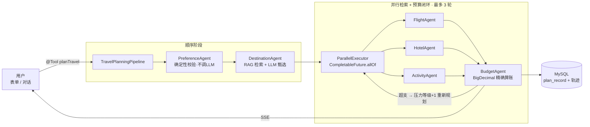

<div align="center">

# 🧭 璃途 Glassway · AI 旅游行程智能规划平台

**多智能体协作 × RAG 城市知识库 × MCP 工具生态 × 玻璃拟态单页前端**

[](https://openjdk.java.net/)
[](https://spring.io/projects/spring-boot)
[](https://docs.langchain4j.dev/)
[](https://www.mysql.com/)
[](https://www.mongodb.com/)
[](LICENSE)

*A Multi-Agent travel planning platform — Pipeline + Parallel Retrieval + Budget Feedback Loop, powered by LangChain4j.*

</div>

---

基于 LangChain4j AiServices 的多智能体旅行规划系统：**顺序流水线（偏好 → 目的地）+ 并行检索（航班 / 酒店 / 活动，`CompletableFuture.allOf`）+ 预算反馈闭环（最多 3 轮）**。全程真实调用 LLM，LLM 输出经白名单 / 数值净化后进入共享状态；前端为一张玻璃拟态单页，规划过程实时可视化。


## 📸 界面预览


## ✨ 功能特性

- 🧭 **多智能体规划流水线**：偏好校验 → RAG+LLM 甄选目的地 → 航班/酒店/活动三路并行 → 预算评估闭环，LLM 只做语义生成，金额/日期/流程控制全部由确定性代码完成
- 🌆 **RAG 城市知识库**：10 个中国城市 Markdown 知识库，Pinecone 持久化向量检索（bge-m3），入库幂等，Embedding 不可用时自动降级，扩城市只加文档不改代码
- 💬 **对话式规划**：SSE 流式对话 + 会话记忆持久化（MongoDB），LLM 通过 Function Calling 自主决定何时触发规划流水线
- 📊 **执行轨迹可视化**：每个智能体的开始/完成/失败、RAG 检索子步骤、预算每轮闭环全部记录并实时推送，历史规划可回放真实轨迹
- 🔌 **MCP 客户端**：接入外部 MCP server（默认内置 Open-Meteo 天气 + 官方演示 server），对话中可查实时天气，工具与本地 `@Tool` 并列按需调用
- 🪟 **玻璃拟态单页前端**：零构建，落地页 + 手动规划面板 + 行程列表/详情 + 悬浮对话窗（含历史会话切换）集成在一张页面
- 🗄️ **持久化**：规划记录落 MySQL（含完整结果 JSON 与执行轨迹），会话记忆存 MongoDB，跨重启不丢

## 🏗️ 架构





| Agent | 调用 LLM | 职责与防护 |
|---|---|---|
| `PreferenceAgent` | ❌ | 卫语句确定性校验，精确可复现 |
| `DestinationAgent` | ✅ | RAG 语义检索候选城市，LLM 只能在白名单内选择；失败回退关键词打分 |
| `FlightAgent` | ✅ 并行 | LLM 生成候选 + 推荐；净化过滤非法价格，推荐号必须命中候选 |
| `HotelAgent` | ✅ 并行 | 晚数/间数由代码计算；星级钳制 2~5、房价过滤 |
| `ActivityAgent` | ✅ 并行 | 代码枚举日期，知识库真实景点池注入提示词，缺失日期兜底补齐 |
| `BudgetAgent` | ⚠️ 仅建议 | 金额用 `BigDecimal` 确定性汇总；超支时 LLM 生成量化调整建议 |

**设计原则**：LLM 负责语义生成，确定性代码负责校验、金额与流程控制；失败路径全部收敛（单 Agent 异常舱壁隔离 → 状态机 `FAILED`；Embedding 不可用 → 全量候选；LLM 失败 → 确定性兜底）。

## 🚀 快速开始

### 环境要求

| 依赖 | 要求 |
|---|---|
| JDK | 21 |
| Maven | 3.9+ |
| MySQL | 8.x（库名 `travel_planner`，启动自动建表） |
| MongoDB | 4.x+（默认 `localhost:27017`） |
| LLM API Key | 任意 OpenAI 兼容端点（智谱 / DeepSeek / 通义 / OpenAI / Ollama） |
| Node.js | 可选，仅 MCP 客户端需要 |

### 1. 配置密钥

支持环境变量（优先）或本项目根目录的 `application-local.yml`（建议加入 `.gitignore`）：

```yaml
app:
  llm:
    api-key: <你的 LLM Key>
  rag:
    embedding-api-key: <Embedding Key，可空>
    pinecone-api-key: <Pinecone Key，可空>
```

常用 LLM 端点（OpenAI 兼容协议，改 `LLM_BASE_URL` + `LLM_MODEL_NAME` 即可）：

| 厂商 | LLM_BASE_URL | 模型示例 |
|---|---|---|
| 智谱 AI | `https://open.bigmodel.cn/api/paas/v4` | `glm-4.5-air` |
| DeepSeek | `https://api.deepseek.com/v1` | `deepseek-chat` |
| OpenAI | `https://api.openai.com/v1` | `gpt-4o-mini` |
| Ollama（本地） | `http://localhost:11434/v1` | `qwen2.5:7b` |

### 2. 启动

```bash
mvn spring-boot:run
```

| 入口 | 地址 |
|---|---|
| **平台首页（GLASSWAY 单页）** | <http://localhost:8080/> |
| 接口文档 Knife4j | <http://localhost:8080/doc.html> |
| 健康检查 | <http://localhost:8080/api/health> |

> 一次完整规划约发起 5~7 次 LLM 调用（并行阶段 3 次同时进行），端到端 40~150 秒。

### 3. 测试

```bash
mvn test
```

5 个用例（健康检查 / 输入校验 400 / LLM 不可达 502 收敛 / 知识库 / 系统状态），使用假 Key + 不可达端点，不产生真实费用，可在 CI 直接运行。

## 🌆 RAG 城市知识库

知识来自 `src/main/resources/knowledge/*.md`（每城一篇，含亮点 / 经典活动与参考价）：

- **知识可运营**：新增城市只需加文档、重启即生效，不改代码
- **双层供给**：结构化字段（亮点/活动/消费水平）直接注入 Agent 提示词，全文向量块用于语义检索排序
- **入库幂等**：分块 ID = `uuid(城市#块序号)` 确定性生成，Pinecone 按 ID 覆盖写；先向量化后写库；写入前清空重灌，不留过期碎片
- **双重降级**：Embedding 服务不可用时语义检索退化为全量候选，本地解析路径零外部依赖

## 🔌 MCP 客户端

对话助理可调用外部 MCP server 的工具（与本地 `@Tool` 并列，模型按需选择）：

```yaml
app:
  mcp:
    enabled: ${MCP_ENABLED:false}   # 开启后重启生效
    servers:
      - name: weather
        type: stdio
        command: [npx, -y, open-meteo-mcp]      # Open-Meteo 天气，免费无 Key
      # - name: remote
      #   type: http
      #   url: http://localhost:3001/mcp          # Streamable HTTP 端点
```

- 支持 **stdio**（拉起子进程，Windows 下自动经 `cmd /c`）与 **Streamable HTTP** 双传输
- 启动期逐个握手探活，单个 server 连不上只告警跳过；`McpClient` 实现 `AutoCloseable`，应用关闭时显式释放
- 内置默认配置：`@modelcontextprotocol/server-everything`（链路验证）+ `open-meteo-mcp`（实时天气）

## 💬 对话式规划与执行轨迹

- 对话入口 `POST /api/chat` 为标准 SSE，命名事件：`token`（逐 token 正文）、`trace`（执行轨迹 JSON）、`done`（结束哨兵）
- 前端悬浮对话窗实时点亮多智能体轨迹（转圈=执行中，✓/✕=完成/失败，含耗时与结果摘要），完成后自动折叠
- 对话助理具备**历史会话切换 / 新会话 / 删除会话记忆**能力；信息不足时先追问而非编造参数
- 规划能力不在对话里"变味"：LLM 只决定"何时调用 + 填参数"，规划仍由同一条确定性流水线执行

## 💾 数据持久化

| 存储 | 库 | 内容 |
|---|---|---|
| MySQL | `travel_planner` | `plan_record`：输入参数回显 + 完整结果 JSON + 执行轨迹，启动自动建表 |
| MongoDB | `travel_planner_memory` | `chat_memory`：按 sessionId 隔离的对话消息（窗口 100 条），跨重启不丢 |

## 📡 API 一览

| 方法 | 路径 | 说明 |
|---|---|---|
| POST | `/api/plan` | 表单入口规划（同步，40~150 秒） |
| POST | `/api/chat` | 对话入口（SSE：token/trace/done） |
| GET | `/api/chat/sessions` · `/{sid}/messages` · DELETE `/{sid}` | 会话列表 / 历史 / 删除 |
| GET | `/api/plans[?sessionId=]` · `/{id}` · DELETE `/{id}` | 规划历史聚合 / 详情 / 删除 |
| GET | `/api/knowledge/cities` · `/api/system/status` · `/api/health` | 知识库 / 系统状态 / 健康检查 |

完整文档见 Knife4j（`/doc.html`），接口已用 `@Tag/@Operation/@Schema` 标注中文说明。

## 📁 项目结构

```
src/main/java/com/travel
├── agent/          # 模板方法基类 + 6 个智能体（含 llm/ AiService 接口）
├── config/         # LLM/RAG/MCP/线程池/记忆/建表 配置
├── controller/     # REST 入口（规划/对话/历史/知识库/系统状态）
├── mapper/entity/  # MyBatis-Plus 持久层
├── model/          # 领域模型 + TraceEvent/TraceCollector 轨迹
├── orchestrator/   # 流水线 / 并行执行器 / 预算闭环
├── rag/            # 城市知识库（向量化 + 降级）
├── service/        # 应用服务（规划/记录/对话/轨迹发布）
├── store/          # MongoDB 会话记忆
└── tools/          # LLM 可调用工具（规划/查单/删单）
src/main/resources
├── knowledge/      # 10 个城市知识库 Markdown
└── static/         # GLASSWAY 单页前端（index.html）+ 旧版备用页
```

## 🗺️ Roadmap

- [ ] 管理端锁定模块（酒店库 / 航班库主数据 + Agent 接入）
- [ ] 规划流水线消费实时天气（雨天自动调整行程）
- [ ] 行程单导出（PDF / ICS 日历）
- [ ] 测试数据库隔离（H2 内存库）

## 📄 License

本项目基于 **[MIT License](LICENSE)** 开源发布。

- ✅ **允许**：自由使用、复制、修改、合并、分发（含商用），只需在软件副本中保留原始版权声明与许可文本
- ❌ **免责**：软件按"现状"提供，作者不对任何使用后果承担责任
- 📦 **第三方依赖**：Spring Boot、LangChain4j、MyBatis-Plus、Knife4j 等各自遵循其原始开源协议，MIT 仅覆盖本项目自有代码
- ✏️ `LICENSE` 文件中的版权行默认署名 `Glassway Contributors`，可自行替换为你的 GitHub 用户名或真实姓名

---

⭐ 觉得有用的话点个 Star 支持一下～
